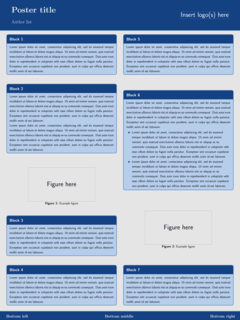
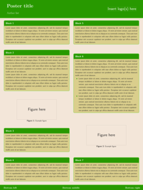
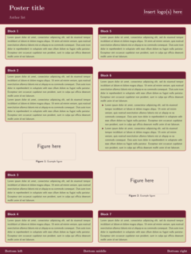
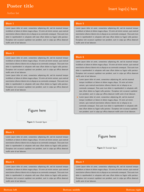
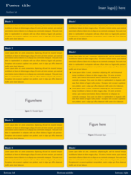

# PALETTE

A theme for [https://www.ctan.org/pkg/beamerposter](beamerposter).

[](samples/ex-blue.pdf) [](samples/ex-green.pdf) [](samples/ex-red.pdf) [](samples/ex-caltech.pdf) [](samples/ex-goblue.pdf)


## Package options

The only package option is ```colorscheme```. Currently available colorschemes are

 - blue (default)
 - green
 - red
 - caltech (Orange)
 - goblue (University of Michigan maize and blue)

Colorschemes are defined by five basic colors; it is straightforward to add new color schemes to the package.

## Example

```
\documentclass{beamer}
\usepackage[orientation=portrait, size=a1, scale=1.4]{beamerposter}

\mode<presentation>{\usetheme[theme=red]{palette}}

% Header
\title{Poster title}
\author{Author list}
\institute{\fbox{\huge Insert logo(s) here}}
 
% Footer
\footLeft{Bottom left}
\footMid{Bottom middle}
\footRight{Bottom right}

\begin{document}
\begin{frame}

% Content goes here

\end{frame}
\end{document}
```